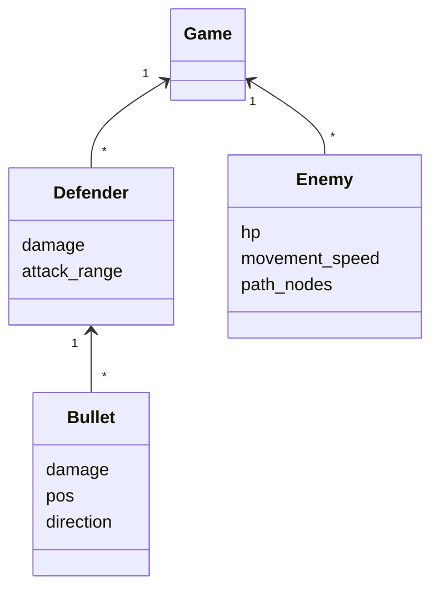

## Sovelluslogiikka

Peli pyörii luokassa [Game](https://github.com/kuussant/ot-harjoitustyo/blob/main/towerdefence/src/game.py), pelin puolustajia [Defender](https://github.com/kuussant/ot-harjoitustyo/blob/main/towerdefence/src/sprites/defender.py) ja vihollisia [Enemy](https://github.com/kuussant/ot-harjoitustyo/blob/main/towerdefence/src/sprites/enemy.py)
voi toistaiseksi asetella kartalle vapaasti. Kun vihollinen lähestyy puolustajaa, ampuu puolustaja luoteja [Bullet](https://github.com/kuussant/ot-harjoitustyo/blob/main/towerdefence/src/sprites/bullet.py)
vihollista kohti. Jos luodit osuvat, vähentävät nämä vihollisen hp-arvoa kunnes vihollinen kuolee.

