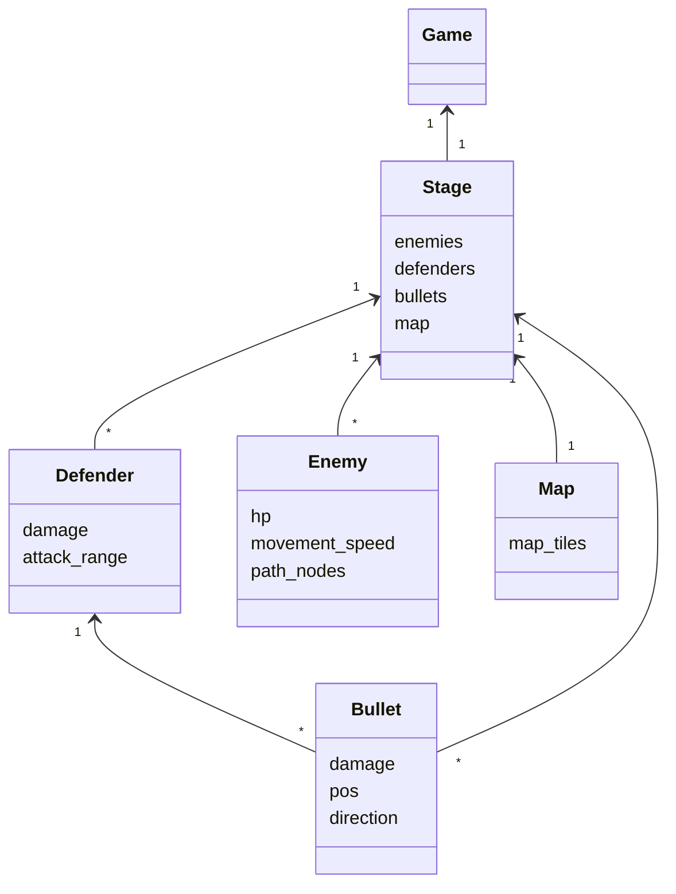
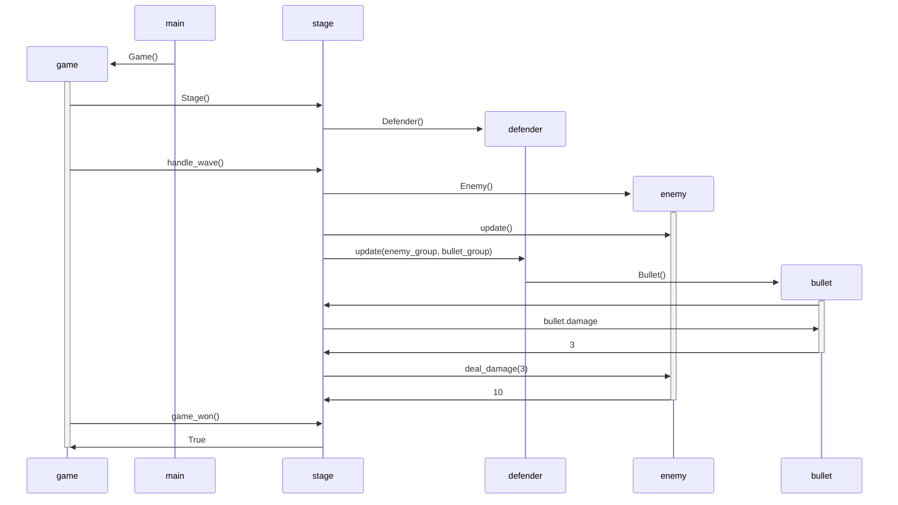

## Sovelluslogiikka

Pelin looppi pyörii luokassa [Game](https://github.com/kuussant/ot-harjoitustyo/blob/main/towerdefence/src/game.py), joka luo pelin logiikan sisältävän olion [Stage](https://github.com/kuussant/ot-harjoitustyo/blob/main/towerdefence/src/stage.py). Pelin puolustajia [Defender](https://github.com/kuussant/ot-harjoitustyo/blob/main/towerdefence/src/sprites/defender.py) asetellaan pelikartan ruudukoihin, jos pelaajalla riittää rahaa. Kun pelaaja on valmis, painaa tämä välilyöntiä, jolloin ensimmäinen kierros voi alkaa. Kierroksen aikana vihollisia [Enemy](https://github.com/kuussant/ot-harjoitustyo/blob/main/towerdefence/src/sprites/enemy.py)
alkaa spawnata. Kun vihollinen lähestyy puolustajia, ampuu puolustajat luoteja [Bullet](https://github.com/kuussant/ot-harjoitustyo/blob/main/towerdefence/src/sprites/bullet.py)
vihollista kohti. Jos luodit osuvat, vähentävät nämä vihollisen hp-arvoa kunnes vihollinen kuolee. Jokaisesta viholliskuolemasta pelaaja ansaitsee rahaa. Kun kaikki viholliset ovat kuolleet, voi pelaaja aloittaa uuden kierroksen.

## Sekvenssikaavio

Ohjelman looppi alkaa käynnistämällä index.py tiedoston missä luodaan Game-olio. Game olio luo Stage-olion joka sisältää pelin logiikan. Game-loopissa pelaaja voi asetella puolustajia (Defender). 

Kun pelaaja on valmis, painaa tämä välilyöntiä jolloin kierros alkaa. Kierroksen aikana kartalle alkaa ilmestyä vihollisia (Enemy). Jokaisen Stage-luokassa tapahtuvan updaten aikana liikutetaan vihollisia ja tarkistetaan onko vihollinen tarpeeksi lähellä puolustajaa. Kun vihollinen on tarpeeksi lähellä puolustajaa, ampuu puolustaja luodin (Bullet), joka palautetaan Stage-luokkaan. 

Jos luoti osuu viholliseen, tarkistetaan paljonko se tekee vahinkoa, ja sen jälkeen vahingoitetaan osunutta vihollista. Vihollinen ottaa vahinkoa luodin verran (3), joka riittää tappamaan vihollisen, jonka jälkeen tämä palauttaa palkinnoksi rahasumman (10) pelaajalle.

Kun viimeinen vihollinen on tapettu, kysyy Game luokalta stage onko peli päättyntyt, johon Stage palauttaa arvon True, jolloin peli vihdoin päättyy.
