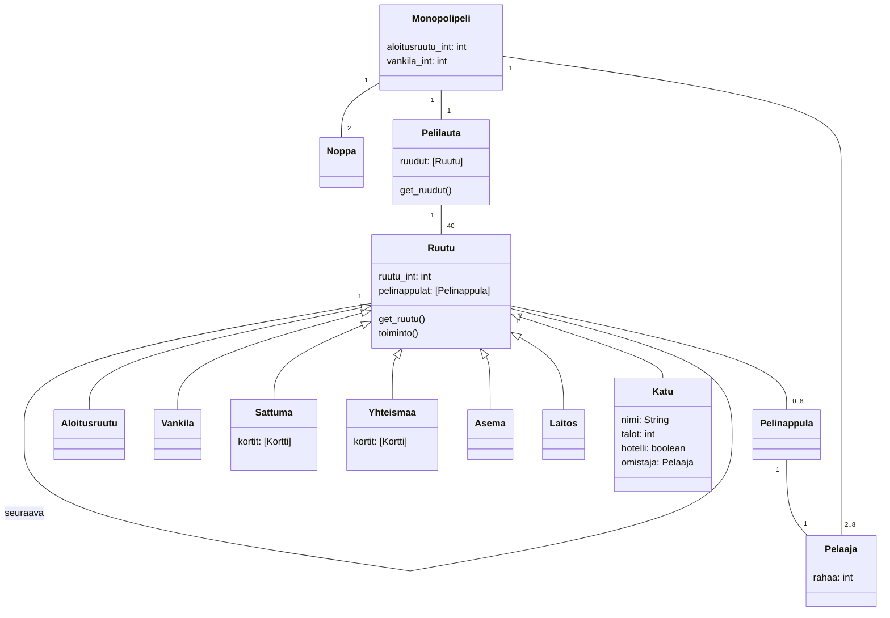

## Monopoli, alustava luokkakaavio

```mermaid
 classDiagram
    Monopolipeli "1" -- "2" Noppa
    Monopolipeli "1" -- "1" Pelilauta
    Pelilauta "1" -- "40" Ruutu
    Ruutu "1" -- "1" Ruutu : seuraava
    Ruutu "1" -- "0..8" Pelinappula
    Pelinappula "1" -- "1" Pelaaja
    Pelaaja "2..8" -- "1" Monopolipeli

    Ruutu <|-- Aloitusruutu
    Ruutu <|-- Vankila
    Ruutu <|-- Sattuma
    Ruutu <|-- Yhteismaa
    Ruutu <|-- Asema
    Ruutu <|-- Laitos
    Ruutu <|-- Katu

    class Monopolipeli {
        aloitusruutu_int: int
        vankila_int: int
    }

    class Pelilauta {
        ruudut: [Ruutu]
        get_ruudut()
    }

    class Ruutu {
      ruutu_int: int
      pelinappulat: [Pelinappula]
      get_ruutu()
      toiminto()   
    }

    class Sattuma {
        kortit: [Kortti]
    }

    class Yhteismaa {
        kortit: [Kortti]
    }

    class Katu {
        nimi: String
        talot: int
        hotelli: boolean
        omistaja: Pelaaja
    }

    class Pelaaja {
        rahaa: int
    }
```

