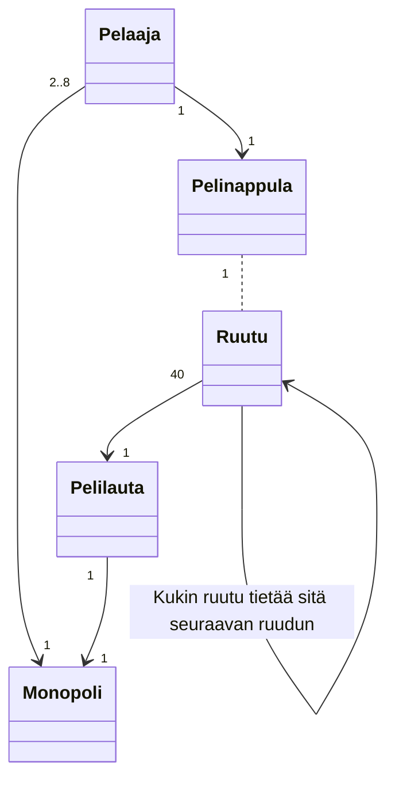

```mermaid
  classDiagram
      Pelaaja "2..8" --> "1" Monopoli
      Pelilauta "1" --> "1" Monopoli
      Ruutu "40" --> "1" Pelilauta
      Ruutu --> Ruutu : Kukin ruutu tietää sitä seuraavan ruudun
      Pelaaja "1" --> "1" Pelinappula
      Pelinappula "1" .. Ruutu
```
