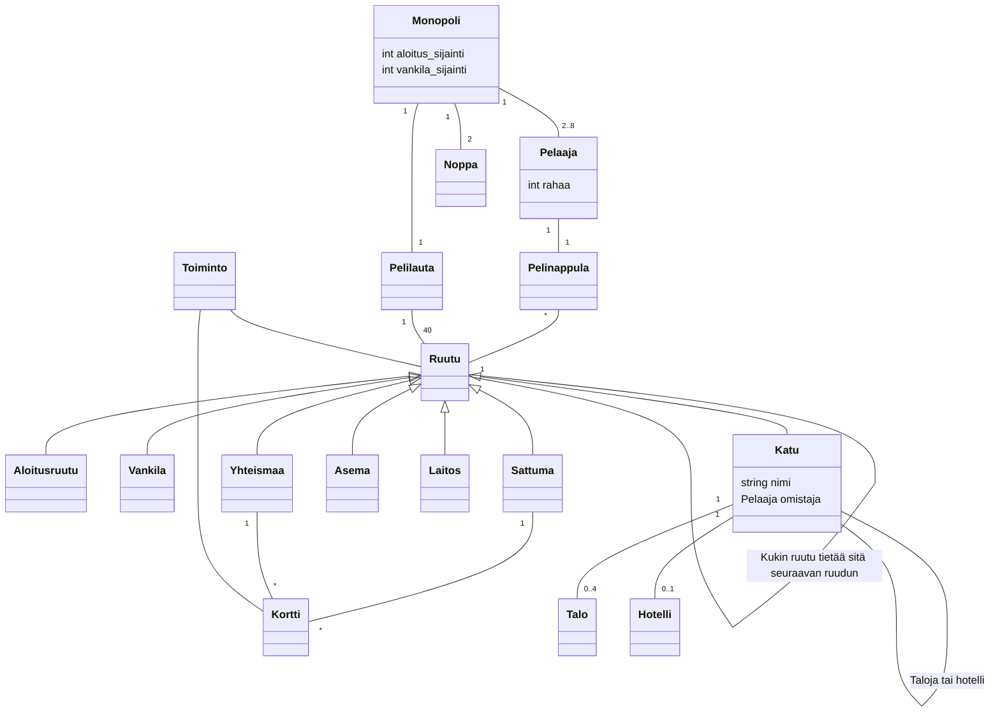

```mermaid
  classDiagram
      Monopoli "1" -- "2..8" Pelaaja
      Monopoli "1" -- "1" Pelilauta
      Monopoli "1" -- "2" Noppa
      Monopoli : int aloitus_sijainti
      Monopoli : int vankila_sijainti
      Pelaaja : int rahaa
      Pelaaja "1" -- "1" Pelinappula
      Pelinappula "*" -- "1" Ruutu
      Pelilauta "1" -- "40" Ruutu
      Ruutu -- Ruutu : Kukin ruutu tietää sitä seuraavan ruudun
      Toiminto -- Ruutu
      Ruutu <|-- Aloitusruutu
      Ruutu <|-- Vankila
      Ruutu <|-- Sattuma
      Ruutu <|-- Yhteismaa
      Ruutu <|-- Asema
      Ruutu <|-- Laitos
      Ruutu <|-- Katu
      Sattuma "1" -- "*" Kortti
      Yhteismaa "1" -- "*" Kortti
      Toiminto -- Kortti
      Katu : string nimi
      Katu : Pelaaja omistaja
      Katu -- Katu : Taloja tai hotelli
      Katu "1" -- "0..4" Talo
      Katu "1" -- "0..1" Hotelli
```
