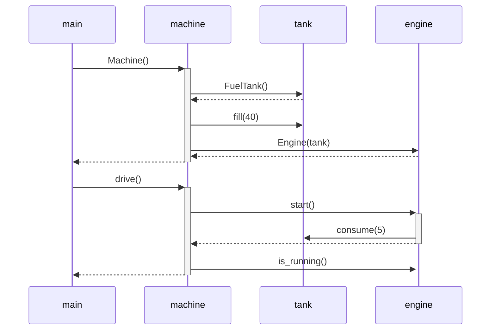

```mermaid
 sequenceDiagram
    participant main
    participant machine
    participant tank
    participant engine
    main ->>+ machine : Machine()
    machine ->> tank : FuelTank()
    tank -->> machine :  
    machine ->> tank : fill(40)
    machine ->> engine : Engine(tank)
    engine -->> machine :  
    machine -->>- main : 
    main ->>+ machine : drive()
    machine ->>+ engine : start()
    engine ->> tank : consume(5)
    engine -->>- machine : 
    machine ->>+ engine : is_running()
    machine -->>- main :  
```
