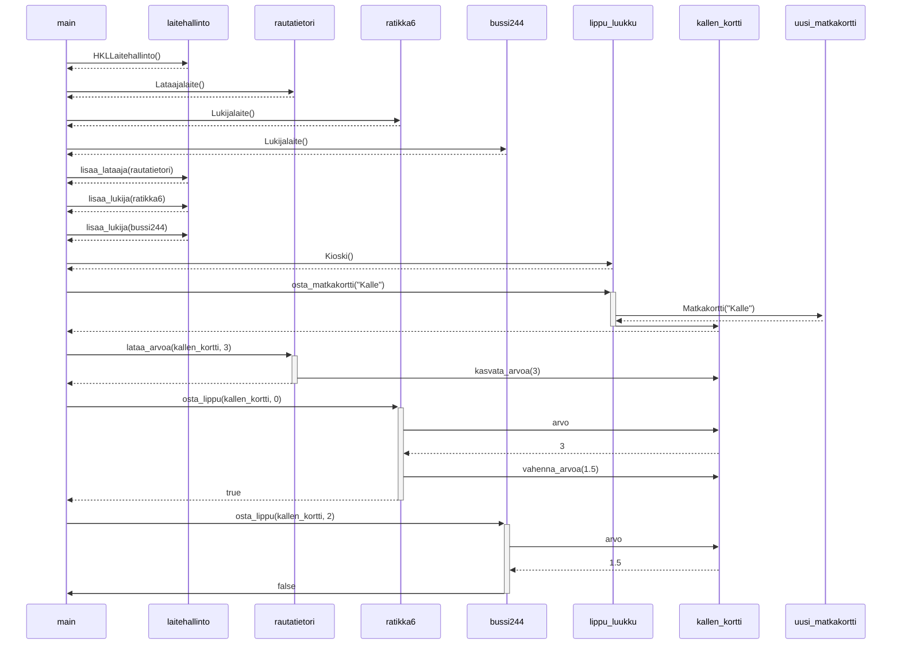

```mermaid
  sequenceDiagram
    participant main
    participant laitehallinto
    participant rautatietori
    participant ratikka6
    participant bussi244
    participant lippu_luukku
    participant kallen_kortti
    participant uusi_matkakortti
    
    main ->> laitehallinto : HKLLaitehallinto()
    laitehallinto -->> main :  
    main ->> rautatietori : Lataajalaite()
    rautatietori -->> main :  
    main ->> ratikka6 : Lukijalaite()
    ratikka6 -->> main :  
    main ->> bussi244 : Lukijalaite()
    bussi244 -->> main :  
    
    main ->> laitehallinto : lisaa_lataaja(rautatietori)
    laitehallinto -->> main :  
    main ->> laitehallinto : lisaa_lukija(ratikka6)
    laitehallinto -->> main :  
    main ->> laitehallinto : lisaa_lukija(bussi244)
    laitehallinto -->> main :  
    
    main ->> lippu_luukku : Kioski()
    lippu_luukku -->> main :  
    main ->>+ lippu_luukku : osta_matkakortti("Kalle")
    lippu_luukku ->>+ uusi_matkakortti : Matkakortti("Kalle")
    uusi_matkakortti -->> lippu_luukku :  
    lippu_luukku ->>- kallen_kortti :  
    kallen_kortti -->> main :  
    main ->>+ rautatietori : lataa_arvoa(kallen_kortti, 3)
    rautatietori ->> kallen_kortti : kasvata_arvoa(3)
    rautatietori -->>- main :  
    main ->>+ ratikka6 : osta_lippu(kallen_kortti, 0)
    ratikka6 ->> kallen_kortti : arvo
    kallen_kortti -->> ratikka6 : 3
    ratikka6 ->> kallen_kortti : vahenna_arvoa(1.5)
    ratikka6 -->>- main : true
    main ->>+ bussi244 : osta_lippu(kallen_kortti, 2)
    bussi244 ->> kallen_kortti : arvo
    kallen_kortti -->> bussi244 : 1.5
    bussi244 ->>- main : false
    
```
